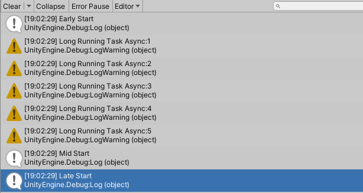
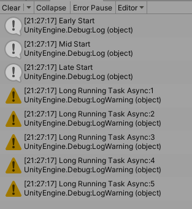

# I have finally learned the basics of async-await as a Unity game dev
### December 2020
---
For a long time now, I never really learned async-await properly. I do have an idea of what they are and why they're so important.

Mostly because I never really sat down and actually learned it, and even when I try to, it was really weird to me how it wasn't performing the way I expected it to.

I do use them, but at the behest of the IDE and not really much thinking about why we need to await and why we need to have async before the type of the function.

But after watching a video from [Unite Copenhagen](https://www.youtube.com/watch?v=7eKi6NKri6I) and reading an article from [Game Torrahod](https://gametorrahod.com/unity-and-async-await/) about the subject I figured it was finally time to learn it. And maybe hopefully elevate my game programming prowess.

The purpose of this post is to hopefully teach newcomers the basics of async-await.

Let's start with a simple script.

```cs
    private void Start()
    {
        Debug.Log("Early Start");

        LongRunningTask();

        Debug.Log("Mid Start");


        Debug.Log("Late Start");
    }
    private void LongRunningTask()
    {

        for (int i = 1; i <= 5; i++)
        {
            Thread.Sleep(100);
            Debug.LogWarning($"Long Running Task Async:{i}");
        }
    }
```

For this example, I've put 3 markers on our `Start()` function to fully visualize async-await.

If we run this example it would perform as expected.



We call `LongRunningTask()` after `Early Start` which prints out all these LogWarnings before `Mid Start` and `Late Start` even begins.

Now we do have a `Thread.Sleep(100);` which all it does is delays execution to the next line by 100ms.

Now let's run `LongRunningTask()` in async.

To do this, we need to wrap `LongRunningTask()` in a lambda.

```cs
    private void Start()
    {
        Debug.Log("Early Start");

        Task.Run(()=>LongRunningTask());

        Debug.Log("Mid Start");


        Debug.Log("Late Start");
    }
    private void LongRunningTask()
    {

        for (int i = 1; i <= 5; i++)
        {
            Thread.Sleep(100);
            Debug.LogWarning($"Long Running Task Async:{i}");
        }
    }
```

`Task.Run(()=>{})` or `Task.Run(()=>NotAsyncMethod())` Spins up a thread from the threadpool and runs the code inside it in async.

If we were to run this in unity.



It ran in async!

The `Start` function finished doing all it's `Debug.Log()` before `LongRunningTask()` even started to print its own!

Now, the purpose of any async function is to do some sort of heavy-task or a task that we need to wait for a significant amount of time without blocking the main thread. Let's say, we need to calculate the distance to the moon from mars because we're making the next Kirby Space Program. As a Unity game dev, any sort of lag/stuttering/micro-stutters is unacceptable in the eyes of many gamers and that heavy calculation should be better off being calculated in another thread.

So how can we return a value from a Task? Simple. We `await` it.

Let's modify our `LongRunningTask()` to return a string for us.

```cs
    private string LongRunningTask()
    {
        for (int i = 1; i <= 5; i++)
        {
            Thread.Sleep(100);
            Debug.LogWarning($"Long Running Task Async:{i}");
        }
        return "DONE! Long Running Task!";
    }
```

After our `LongRunningTask()` is done, it should return us a string. Let's await it and see what happens.

```cs
    private async void Start()
    {
        Debug.Log("Early Start");

        var message = await Task.Run(()=>LongRunningTask());
        Debug.Log(message);

        Debug.Log("Mid Start");


        Debug.Log("Late Start");
    }

    private string LongRunningTask()
    {
        for (int i = 1; i <= 5; i++)
        {
            Thread.Sleep(100);
            Debug.LogWarning($"Long Running Task Async:{i}");
        }
        return "DONE! Long Running Task!";
    }
```

We can't call `await` on anything without putting `async` before the type of the calling function.

Now by convention, when we have a function that has async on it we **should** return a Task instead of void like this.

```cs
    private async Task Start()
```

But Unity doesn't recognize `Task Start` so `Start` won't get called. So as an exception to the rule, we'll leave it at void. **However**, avoid `async void`. Always do `async Task Method()` whenever you can. More on this [here](https://github.com/davidfowl/AspNetCoreDiagnosticScenarios/blob/master/AsyncGuidance.md#async-void).

Now, let's run the code and see what happens.


Woah. It didn't run async? Why?

The thing with `await` is, as the name implies, it **waits** for the task's return value. Now it does this ***without blocking*** the main thread. Meaning your game/program won't be unresponsive for 500ms!

But wait, that's no good. That purpose of async programming is to do stuff in one thread while we do some work in the main thread.

Simple, we start the Task and await it at a later time.

```cs
    private async void Start()
    {
        Debug.Log("Early Start");

        Task<string> task = Task.Run(() => LongRunningTask());

        Debug.Log("Mid Start");

        string message = await task;
        Debug.Log(message);

        Debug.Log("Late Start");
    }
    private string LongRunningTask()
    {
        for (int i = 1; i <= 5; i++)
        {
            Thread.Sleep(100);
            Debug.LogWarning($"Long Running Task Async:{i}");
        }
        return "DONE! Long Running Task!";
    }
```

Now it does return a string so we need to declare what type it is, like so: `Task<string>`.

Now, let's run.


And viola! It now runs in async!

Let's go for one more example as we're nearing the end of this article. And, I suspect many of you who are read this far has now so many ideas running through your head.

Consider the following code:

```cs
    private async void Start()
    {
        Debug.Log("Early Start");

        Task<string> task = Task.Run(() => LongRunningTaskAsync());

        Debug.Log("Mid Start");

        string message = await task;
        Debug.Log(message);

        Debug.Log("Late Start");
    }

    private async Task<string> LongRunningTaskAsync()
    {
        Task<string> message = AnotherLongRunningTaskAnotherLongRunningTaskAsync();
        for (int i = 1; i <= 3; i++)
        {
            Thread.Sleep(100);
            Debug.LogWarning($"Long Running Task Async:{i}");
        }
        Debug.LogError(await message);
        return "DONE! Long Running Task!";
    }

    private Task<string> AnotherLongRunningTaskAsync()
    {
        return Task.Run(() =>
        {
            for (int i = 1; i <= 3; i++)
            {
                Thread.Sleep(100);
                Debug.LogError($"Another Long Running Task Async: {i}");
            }
            return "DONE Another Long Running Job!";
        });
    }
```
Now to summarize, we're running `LongRunningTask` on `Start`. But as soon as it runs, we're also going to run `AnotherLongRunningTask`. `LongRunningTask` will **wait** for `AnotherLongRunningTask` to end before it ends. And `Start` will **wait** for `LongRunningTask` before it prints out `Late Start`.

Notice also I'm now following convention.

Alright? alright. Now this should effectively have 2 Tasks running in async. Let's see the output.


And as expected! 

Both of our Tasks are running at the same time evident by the fact our logs follow a pattern.

## Conclusion

Async-await or Async-await-Task allows us the ability to run multi-threaded code in a easy digestible format.
We run the `Task` by calling the function, or by `Task.Run` and then `await` it when we need to do something with the result from that task.

Now this is only just the basics of async-await and I've probably missed a few key things. But this post is long enough already. I'll leave you with a few articles and videos so you can do the rest of the learning yourself.

## Extra

> [MSDN | Asynchronous programming with async and await](https://docs.microsoft.com/en-us/dotnet/csharp/programming-guide/concepts/async/)

> [David Fowler | AsyncGuidance](https://github.com/davidfowl/AspNetCoreDiagnosticScenarios/blob/master/AsyncGuidance.md)

> [Game Torrahod | Looking into Unity's async/await](https://gametorrahod.com/unity-and-async-await/)

> [Johannes Ahvenniemi | Best practices: Async vs. coroutines - Unite Copenhagen](https://www.youtube.com/watch?v=7eKi6NKri6I)

> [Tim Corey | C# Async / Await - Make your app more responsive and faster with asynchronous programming](https://www.youtube.com/watch?v=2moh18sh5p4)

> [Tim Corey | Advanced Async](https://www.youtube.com/watch?v=ZTKGRJy5P2M)

## Comments

If you do have any comments / questions / critique, feel free to open an [Issue](https://github.com/mfragger/my-blog/issues).

If you want me to write about a topic, feel free to open a [Pull Request](https://github.com/mfragger/my-blog/pulls).